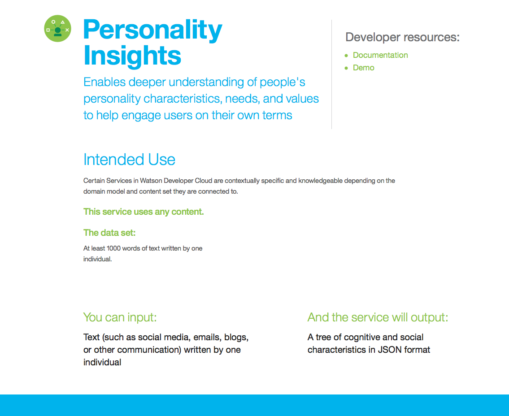

# Fun With IBM Personality Insights

In this project I use Python 3 to play around with [IBM Personality Insights](https://console.bluemix.net/docs/services/personality-insights).
I used [IBM's free Lite service](https://console.bluemix.net/catalog/services/personality-insights),
which provides 1,000 API calls per month at no cost, and deploy to the US South region.

I enabled a Lite
[Personality Insights service instance](https://console.bluemix.net/catalog/services/personality-insights),
which only lasts 30 days.



I followed the [Getting started](9https://console.bluemix.net/docs/services/personality-insights/getting-started.html#getting-started-tutorial)
instructions and referred to the
[API reference](https://www.ibm.com/watson/developercloud/personality-insights/api/).

The service name was automatically created: `Personality Insights-ca`

The Getting Started examples use `curl` to call methods of the HTTP interface.
Ubuntu's version of `curl` installed by default is the correct version.

I used <a href="https://stedolan.github.io/jq/"><code>jq</code></a> to pretty-print the returned JSON.

```
$ sudo apt install jq
```

[Step 1](https://console.bluemix.net/docs/services/personality-insights/getting-started.html#gettingStarted)
of the Getting Started instructions has a serious error: instead of providing the `apiKey`,
your `username:password` must be provided.

```
export PI_USERNAME="999999-8888-7777-6666-12345678" # replace with your Personality Insights username
export PI_PASSWORD="zYxWv"                          # replace with your Personality Insights password
export PATH_OF_TEXT_TO_ANALYSE=./profile.txt
curl -sSX POST --user "$PI_USERNAME:$PI_PASSWORD" \
  --header "Content-Type: text/plain;charset=utf-8" \
  --header "Accept: application/json" \
  --data-binary @"$PATH_OF_TEXT_TO_ANALYSE" \
  "https://gateway.watsonplatform.net/personality-insights/api/v3/profile?version=2017-10-13" \
  jq .
```

Notice the leading `@` character before `$PATH_OF_TEXT_TO_ANALYSE`.
If you don't put that character there, the path is interpreted as the text analyze, instead of the filename of containing the text to analyze.

Here is the output:

```
{
  "word_count": 1365,
  "processed_language": "en",
  "personality": [
    {
      "trait_id": "big5_openness",
      "name": "Openness",
      "category": "personality",
      "percentile": 0.9970814244982862,
      "significant": true,
      "children": [
        {
          "trait_id": "facet_adventurousness",
          "name": "Adventurousness",
          "category": "personality",
          "percentile": 0.7897453561510404,
          "significant": true
        },
        {
          "trait_id": "facet_artistic_interests",
          "name": "Artistic interests",
          "category": "personality",
          "percentile": 0.9946576519208276,
          "significant": true
        },
        {
          "trait_id": "facet_emotionality",
          "name": "Emotionality",
          "category": "personality",
          "percentile": 0.7671631753694048,
          "significant": true
        },
        {
          "trait_id": "facet_imagination",
          "name": "Imagination",
          "category": "personality",
          "percentile": 0.3116772371947263,
          "significant": true
        },
        {
          "trait_id": "facet_intellect",
          "name": "Intellect",
          "category": "personality",
          "percentile": 0.9965199807027889,
          "significant": true
        },
        {
          "trait_id": "facet_liberalism",
          "name": "Authority-challenging",
          "category": "personality",
          "percentile": 0.7979072721493274,
          "significant": true
        }
      ]
    },
    {
      "trait_id": "big5_conscientiousness",
      "name": "Conscientiousness",
      "category": "personality",
      "percentile": 0.986401677449357,
      "significant": true,
      "children": [
        {
          "trait_id": "facet_achievement_striving",
          "name": "Achievement striving",
          "category": "personality",
          "percentile": 0.8403728912342892,
          "significant": true
        },
        {
          "trait_id": "facet_cautiousness",
          "name": "Cautiousness",
          "category": "personality",
          "percentile": 0.9441869457422986,
          "significant": true
        },
        {
          "trait_id": "facet_dutifulness",
          "name": "Dutifulness",
          "category": "personality",
          "percentile": 0.7946276293038677,
          "significant": true
        },
        {
          "trait_id": "facet_orderliness",
          "name": "Orderliness",
          "category": "personality",
          "percentile": 0.761074150640708,
          "significant": true
        },
        {
          "trait_id": "facet_self_discipline",
          "name": "Self-discipline",
          "category": "personality",
          "percentile": 0.7128649175839024,
          "significant": true
        },
        {
          "trait_id": "facet_self_efficacy",
          "name": "Self-efficacy",
          "category": "personality",
          "percentile": 0.6994302718651376,
          "significant": true
        }
      ]
    },
    {
      "trait_id": "big5_extraversion",
      "name": "Extraversion",
      "category": "personality",
      "percentile": 0.08530058556548387,
      "significant": true,
      "children": [
        {
          "trait_id": "facet_activity_level",
          "name": "Activity level",
          "category": "personality",
          "percentile": 0.9624016313415944,
          "significant": true
        },
        {
          "trait_id": "facet_assertiveness",
          "name": "Assertiveness",
          "category": "personality",
          "percentile": 0.9198609213386711,
          "significant": true
        },
        {
          "trait_id": "facet_cheerfulness",
          "name": "Cheerfulness",
          "category": "personality",
          "percentile": 0.2293639969883619,
          "significant": true
        },
        {
          "trait_id": "facet_excitement_seeking",
          "name": "Excitement-seeking",
          "category": "personality",
          "percentile": 0.21024192850794732,
          "significant": true
        },
        {
          "trait_id": "facet_friendliness",
          "name": "Outgoing",
          "category": "personality",
          "percentile": 0.7085191412979603,
          "significant": true
        },
        {
          "trait_id": "facet_gregariousness",
          "name": "Gregariousness",
          "category": "personality",
          "percentile": 0.22458619358371484,
          "significant": true
        }
      ]
    },
    {
      "trait_id": "big5_agreeableness",
      "name": "Agreeableness",
      "category": "personality",
      "percentile": 0.18753528603194114,
      "significant": true,
      "children": [
        {
          "trait_id": "facet_altruism",
          "name": "Altruism",
          "category": "personality",
          "percentile": 0.9713302006331768,
          "significant": true
        },
        {
          "trait_id": "facet_cooperation",
          "name": "Cooperation",
          "category": "personality",
          "percentile": 0.8229934901276241,
          "significant": true
        },
        {
          "trait_id": "facet_modesty",
          "name": "Modesty",
          "category": "personality",
          "percentile": 0.7613188148341663,
          "significant": true
        },
        {
          "trait_id": "facet_morality",
          "name": "Uncompromising",
          "category": "personality",
          "percentile": 0.9471478882849425,
          "significant": true
        },
        {
          "trait_id": "facet_sympathy",
          "name": "Sympathy",
          "category": "personality",
          "percentile": 0.9991179451374892,
          "significant": true
        },
        {
          "trait_id": "facet_trust",
          "name": "Trust",
          "category": "personality",
          "percentile": 0.830111046812001,
          "significant": true
        }
      ]
    },
    {
      "trait_id": "big5_neuroticism",
      "name": "Emotional range",
      "category": "personality",
      "percentile": 0.9438564164580441,
      "significant": true,
      "children": [
        {
          "trait_id": "facet_anger",
          "name": "Fiery",
          "category": "personality",
          "percentile": 0.013938100678606846,
          "significant": true
        },
        {
          "trait_id": "facet_anxiety",
          "name": "Prone to worry",
          "category": "personality",
          "percentile": 0.06202578945407233,
          "significant": true
        },
        {
          "trait_id": "facet_depression",
          "name": "Melancholy",
          "category": "personality",
          "percentile": 0.35285841125133055,
          "significant": true
        },
        {
          "trait_id": "facet_immoderation",
          "name": "Immoderation",
          "category": "personality",
          "percentile": 0.011684379342278672,
          "significant": true
        },
        {
          "trait_id": "facet_self_consciousness",
          "name": "Self-consciousness",
          "category": "personality",
          "percentile": 0.19347068940127599,
          "significant": true
        },
        {
          "trait_id": "facet_vulnerability",
          "name": "Susceptible to stress",
          "category": "personality",
          "percentile": 0.06994539774378472,
          "significant": true
        }
      ]
    }
  ],
  "needs": [
    {
      "trait_id": "need_challenge",
      "name": "Challenge",
      "category": "needs",
      "percentile": 0.0032546536914943025,
      "significant": true
    },
    {
      "trait_id": "need_closeness",
      "name": "Closeness",
      "category": "needs",
      "percentile": 0.370227811018078,
      "significant": true
    },
    {
      "trait_id": "need_curiosity",
      "name": "Curiosity",
      "category": "needs",
      "percentile": 0.845180482624851,
      "significant": true
    },
    {
      "trait_id": "need_excitement",
      "name": "Excitement",
      "category": "needs",
      "percentile": 0.11505596926601463,
      "significant": true
    },
    {
      "trait_id": "need_harmony",
      "name": "Harmony",
      "category": "needs",
      "percentile": 0.4664217424750164,
      "significant": true
    },
    {
      "trait_id": "need_ideal",
      "name": "Ideal",
      "category": "needs",
      "percentile": 0.02263412995273051,
      "significant": true
    },
    {
      "trait_id": "need_liberty",
      "name": "Liberty",
      "category": "needs",
      "percentile": 0.10802987716455864,
      "significant": true
    },
    {
      "trait_id": "need_love",
      "name": "Love",
      "category": "needs",
      "percentile": 0.011895333821013376,
      "significant": true
    },
    {
      "trait_id": "need_practicality",
      "name": "Practicality",
      "category": "needs",
      "percentile": 0.018888178951272094,
      "significant": true
    },
    {
      "trait_id": "need_self_expression",
      "name": "Self-expression",
      "category": "needs",
      "percentile": 0.1848978280656295,
      "significant": true
    },
    {
      "trait_id": "need_stability",
      "name": "Stability",
      "category": "needs",
      "percentile": 0.3946227431440061,
      "significant": true
    },
    {
      "trait_id": "need_structure",
      "name": "Structure",
      "category": "needs",
      "percentile": 0.8880129689346332,
      "significant": true
    }
  ],
  "values": [
    {
      "trait_id": "value_conservation",
      "name": "Conservation",
      "category": "values",
      "percentile": 0.5065929218618476,
      "significant": true
    },
    {
      "trait_id": "value_openness_to_change",
      "name": "Openness to change",
      "category": "values",
      "percentile": 0.6287516949462554,
      "significant": true
    },
    {
      "trait_id": "value_hedonism",
      "name": "Hedonism",
      "category": "values",
      "percentile": 0.005253658217921009,
      "significant": true
    },
    {
      "trait_id": "value_self_enhancement",
      "name": "Self-enhancement",
      "category": "values",
      "percentile": 0.0011936431143393933,
      "significant": true
    },
    {
      "trait_id": "value_self_transcendence",
      "name": "Self-transcendence",
      "category": "values",
      "percentile": 0.3429609693883737,
      "significant": true
    }
  ],
  "warnings": []
}
```
